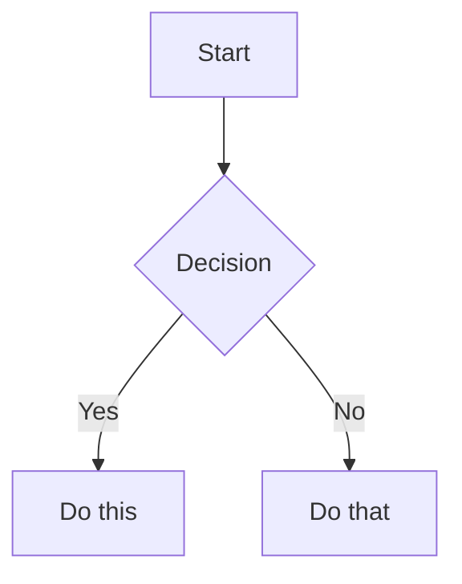

# Obsidian Flavored Markdown Reference

Obsidian extends CommonMark and GFM with wikilinks, embeds, callouts, properties, and comments.

## Internal Links (Wikilinks)

```markdown
[[Note Name]]                          Link to note
[[Note Name|Display Text]]             Custom display text
[[Note Name#Heading]]                  Link to heading
[[Note Name#^block-id]]                Link to block
[[#Heading in same note]]              Same-note heading link
```

Define a block ID by appending `^block-id` to any paragraph:

```markdown
This paragraph can be linked to. ^my-block-id
```

For lists and quotes, place the block ID on a separate line after the block:

```markdown
> A quote block

^quote-id
```

## Embeds

Prefix any wikilink with `!` to embed its content inline:

```markdown
![[Note Name]]                         Embed full note
![[Note Name#Heading]]                 Embed section
![[image.png]]                         Embed image
![[image.png|300]]                     Embed image with width
![[image.png|640x480]]                 Embed image with width x height
![[document.pdf]]                      Embed PDF
![[document.pdf#page=3]]               Embed PDF page
![[document.pdf#height=400]]           Embed PDF with height
![[audio.mp3]]                         Embed audio
```

External images:

```markdown


```

Embed search results:

````markdown
```query
tag:#project status:done
```
````

## Callouts

```markdown
> [!note]
> Basic callout.

> [!warning] Custom Title
> Callout with a custom title.

> [!faq]- Collapsed by default
> Foldable callout (- collapsed, + expanded).
```

### Supported Types

| Type | Aliases | Color / Icon |
|------|---------|-------------|
| `note` | - | Blue, pencil |
| `abstract` | `summary`, `tldr` | Teal, clipboard |
| `info` | - | Blue, info |
| `todo` | - | Blue, checkbox |
| `tip` | `hint`, `important` | Cyan, flame |
| `success` | `check`, `done` | Green, checkmark |
| `question` | `help`, `faq` | Yellow, question mark |
| `warning` | `caution`, `attention` | Orange, warning |
| `failure` | `fail`, `missing` | Red, X |
| `danger` | `error` | Red, zap |
| `bug` | - | Red, bug |
| `example` | - | Purple, list |
| `quote` | `cite` | Gray, quote |

Nested callouts:

```markdown
> [!question] Outer callout
> > [!note] Inner callout
> > Nested content
```

Custom callout CSS:

```css
.callout[data-callout="custom-type"] {
  --callout-color: 255, 0, 0;
  --callout-icon: lucide-alert-circle;
}
```

## Highlighting

```markdown
==Highlighted text==
```

## Comments

```markdown
This is visible %%but this is hidden%% text.

%%
This entire block is hidden in reading view.
%%
```

## Tags

```markdown
#tag                    Inline tag
#nested/tag             Nested tag with hierarchy
#tag-with-dashes        Hyphens allowed
#tag_with_underscores   Underscores allowed
```

Tags can contain: letters (any language), numbers (not first character), underscores, hyphens, forward slashes (for nesting).

## Math (LaTeX)

```markdown
Inline: $e^{i\pi} + 1 = 0$

Block:
$$
\frac{a}{b} = c
$$
```

## Diagrams (Mermaid)

````markdown

````

To link Mermaid nodes to Obsidian notes, add `class NodeName internal-link;`.

## Footnotes

```markdown
Text with a footnote[^1].

[^1]: Footnote content.

Inline footnote.^[This is inline.]
```

## Complete Example

````markdown
---
title: Project Alpha
date: 2024-01-15
tags:
  - project
  - active
status: in-progress
---

# Project Alpha

This project aims to [[improve workflow]] using modern techniques.

> [!important] Key Deadline
> The first milestone is due on ==January 30th==.

## Tasks

- [x] Initial planning
- [ ] Development phase

## Notes

The algorithm uses $O(n \log n)$ sorting. See [[Algorithm Notes#Sorting]] for details.

![[Architecture Diagram.png|600]]

Reviewed in [[Meeting Notes 2024-01-10#Decisions]].
````

## References

- [Obsidian Flavored Markdown](https://help.obsidian.md/obsidian-flavored-markdown)
- [Internal links](https://help.obsidian.md/links)
- [Embed files](https://help.obsidian.md/embeds)
- [Callouts](https://help.obsidian.md/callouts)
- [Properties](https://help.obsidian.md/properties)
