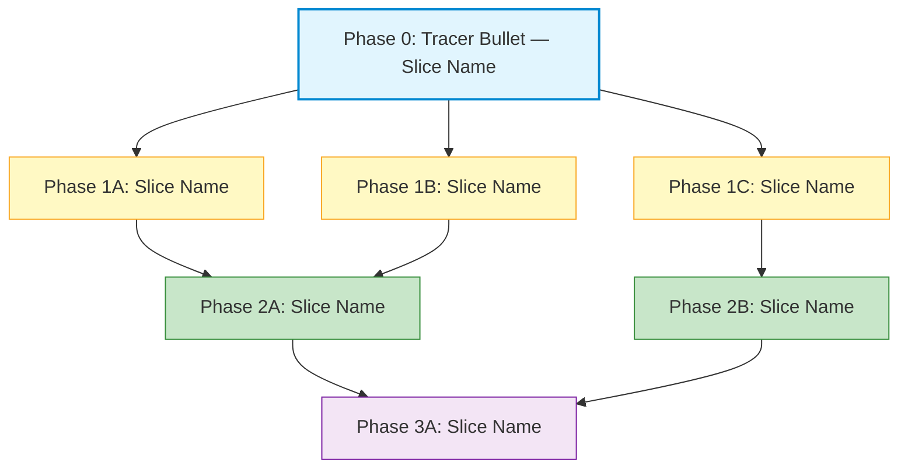
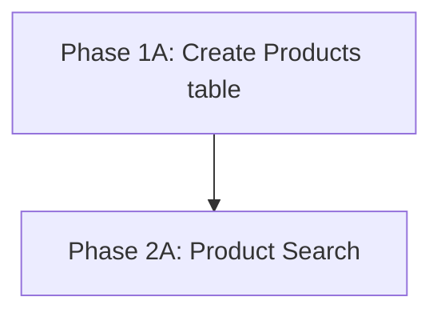
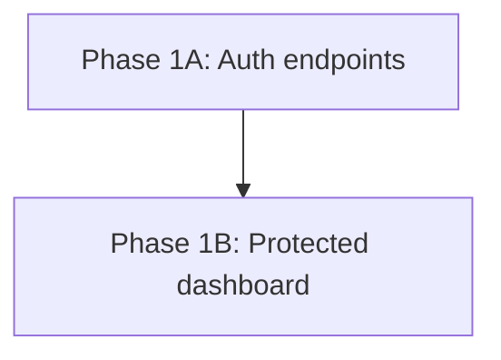
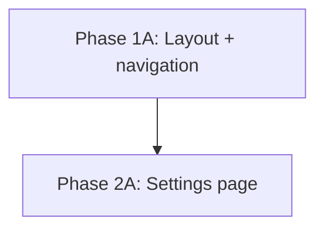
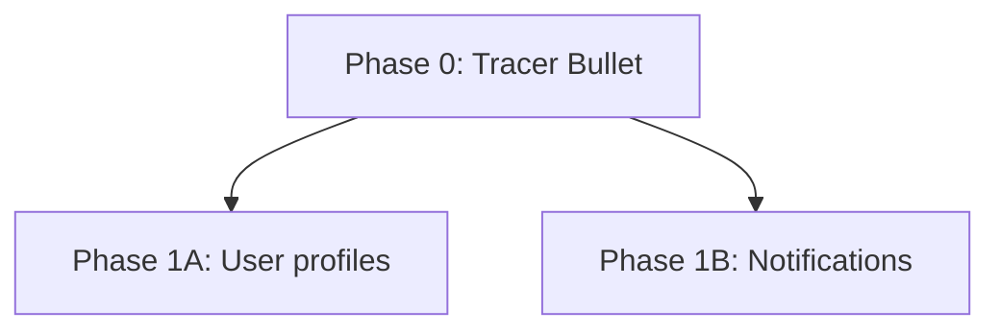
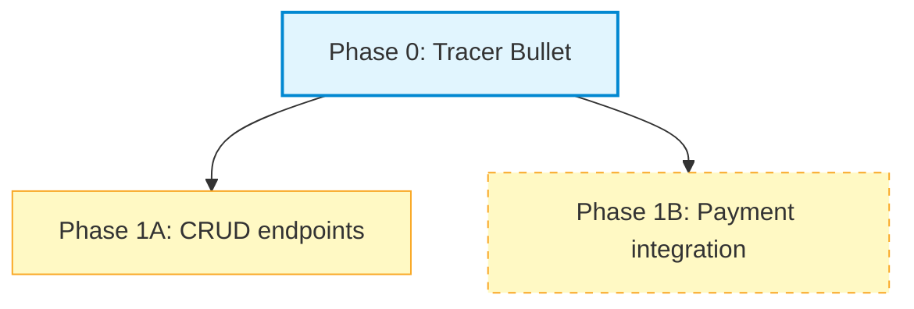
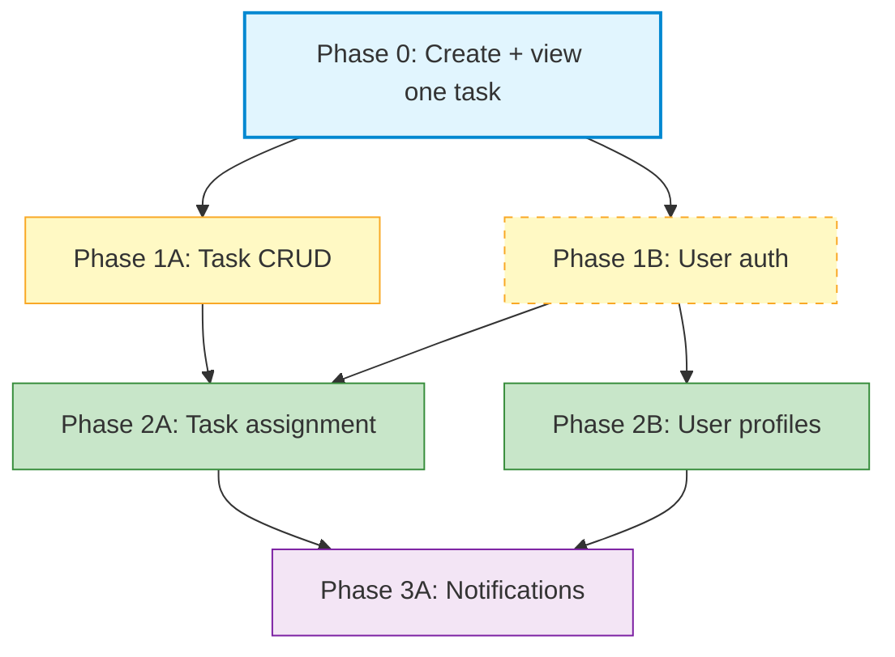

# Dependency Graph Template

## Mermaid Syntax

Use mermaid `graph TD` (top-down) to visualize phase dependencies. Each node represents a phase/slice. Arrows indicate dependency: the arrow **source depends on** the arrow **target**.

---

## Template

---

## How to Read the Graph

| Element | Meaning |
|---|---|
| **Node** | A phase/slice (e.g., `Phase 1A: User Registration`) |
| **Arrow (A → B)** | A depends on B — build B before A |
| **Same level, no arrow between** | Independent — can be built in parallel |
| **Solid border** | AFK — agent can complete autonomously |
| **Dashed border** | HITL — needs human judgment or review |

### Reading order

Start at the bottom of the graph (no outgoing arrows) and work upward. Bottom nodes are built first. Nodes at the same level with no inter-dependencies can be built in parallel.

---

## How to Identify Dependencies

### Data dependencies

Slice B needs a database table or column created by Slice A.

### API dependencies

Slice B calls an API endpoint created by Slice A.

### UI dependencies

Slice B uses a UI component created by Slice A.

### No dependency (parallel)

Slices that share only the Phase 0 foundation can run in parallel.

---

## Maximizing Parallelism

The goal is to **minimize the critical path** — the longest chain of sequential dependencies. Strategies:

1. **Push shared code into Phase 0.** If two Phase 1 slices both need a utility, include it in the tracer bullet so both slices can start simultaneously.
2. **Define API contracts early.** If Slice B calls an endpoint from Slice A, agree on the contract (URL, request/response shape) so Slice B can mock and build in parallel.
3. **Avoid data coupling.** If slices share a table, have one slice own the migration and the other extend it — or co-locate both column additions in Phase 0.
4. **Split read from write.** A "create" slice and a "list" slice for the same entity are often independent of each other after the table exists.

### Parallel indicator in the phase table

In the phase overview table, use the same phase number for slices that can run in parallel:

| Phase | Slice | Dependencies | Parallel? |
|---|---|---|---|
| 0 | Tracer bullet | — | — |
| 1A | User profiles | Phase 0 | Yes (with 1B) |
| 1B | Notifications | Phase 0 | Yes (with 1A) |
| 2A | Profile search | Phase 1A | No |

---

## AFK / HITL Visual Convention

Use border style to distinguish execution mode:

| Border | Meaning | When to use |
|---|---|---|
| **Solid** | AFK — agent can complete autonomously | Standard CRUD, UI components, data transforms, tests |
| **Dashed** | HITL — needs human in the loop | Auth flows, payment, PII handling, third-party API keys, compliance |

### Default to HITL for sensitive domains

When in doubt, mark as HITL. Domains that should almost always be HITL:

- Authentication and authorization
- Payment processing
- PII / personal data handling
- Compliance and audit
- Infrastructure and deployment changes
- Third-party service integration requiring API keys or secrets

---

## Complete Example

A project management tool with tasks, assignments, and notifications:

**Reading this graph:**
- Phase 0 (tracer bullet) must be built first.
- Phase 1A (Task CRUD) and Phase 1B (User auth) can be built in parallel — both depend only on Phase 0.
- Phase 1B has a dashed border — it is HITL because it involves authentication.
- Phase 2A (Task assignment) depends on BOTH Phase 1A (needs tasks) and Phase 1B (needs users).
- Phase 2B (User profiles) depends only on Phase 1B (needs auth).
- Phase 3A (Notifications) depends on both Phase 2A and Phase 2B.
